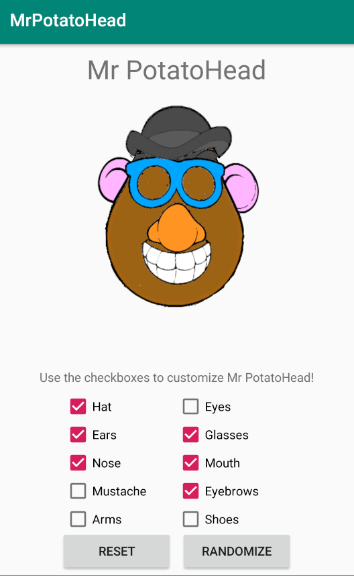
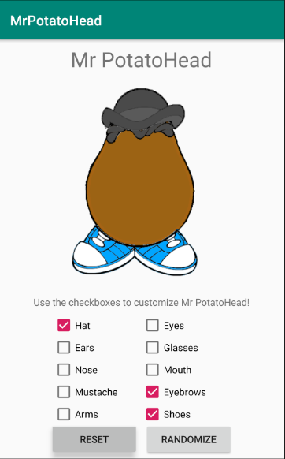
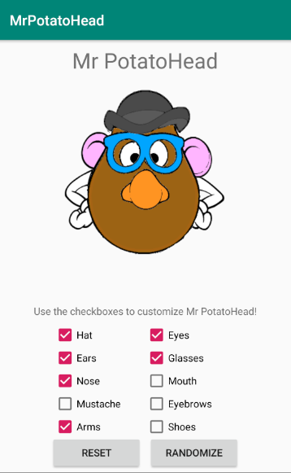
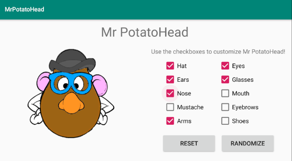

# Mr PotatoHead

An app, developed in Android Studio, that allows the user to create their ideal version of Mr PotatoHead. Some of the features of this app are full functionality in both portrait and landscape mode, Mr PotatoHead randomization button, a reset button and memory manamgement through the use of Bundles. See below for a couple of screenshots illustrating the usage of this app.

## Randomize and reset buttons

## Working landscape mode, memory management to save state of potatohead

